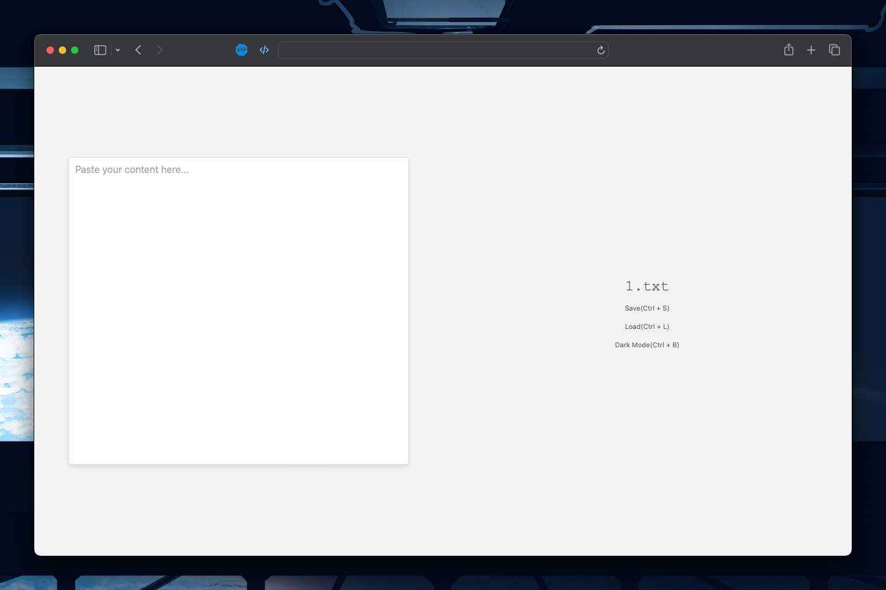

## 在线剪切板
使用方法：
1. git clone 本项目到服务器的 nginx 目录下 （如 /var/www/html）
2. 按照 [api-readme](/my-api/readme.md) 启动 `nodejs` api服务器，会使用3000端口

## 截图

<div align="center">
	
</div>

## docker 用法

arm-64
```shell
# 后台模式运行 nodeapi 端口<外部>:<内部默认3000>
docker run -dp 3000:3000 kasusa/webclipboard-nodeapi:v1.0
# 后台模式运行 nginx 端口<外部>:<内部默认80> ， -e 设定nginx访问api的端口
docker run -dp 80:80 -e API_PORT=3000 kasusa/webclipboard-nginx:v1.1
```

x64
```shell
docker run -dp 3000:3000 kasusa/webclipboard-nodeapi:v1.0-x64
docker run -dp 80:80 -e API_PORT=3000 kasusa/webclipboard-nginx:v1.1-x64
```

浏览器访问 `http://<服务器ip>` 即可使用剪切版

---

至于为什么弄成前端后端两个docker ，单纯是因为我不会（今天是用docker的第二天）

每个docker基础镜像只能是一个，而我又要用nginx又要node，所以我就弄了俩。

指定参数可以把api和nginx开在比较高的端口上，适合DDNS，并且不容易被扫到。

---